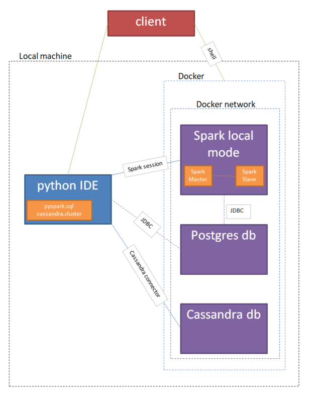
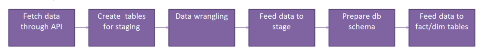

# CurrencyCryptoNews Project

Aim for this project was to prepare data pipeline to answer question "how and if currency and crypto-currency rates are connected to posts and information on Reddit channel r/wallstreetbets"?  
I have incorporated for this purpose relational and non-relational database, docker and various methods for achieving main goal.

# Table of contents
1. [Infrastructure](#infrastructure)
2. [Data](#data)
3. [Model](#model)
4. [Content](#content)
5. [Process](#process)
6. [Challenge](#challenge)

# Infrastructure 
Initial idea was to build cloud solution, however due to some service being available in paid plans I've decided to go with docker containers. 
## Software
I was using: 
- python IDE on Windows machine: PyCharm 2020.3.3
- docker for Windows 3.3.3 (linux containers)
- git 2.30.0.windows.1
- Windows Powershell
- GitHub as remote repository
- Ubuntu on WSL2 
- DataGrip 2021.1.1 as database GUI and for checking results
- psql in Postgres docker container
- cqlsh in Cassandra docker container
- bash in Spark container
- Chrome web browser for Spark monitoring, registering to external services and getting additional knowledge
## Connections
On Windows machine I run Docker with 3 containers:
- Spark 3.0.0 built from bitnami release
- Postgres database 13.1
- Cassandra database 3.11.9  
Those containers are connected to one docker network. 
  To communicate with them I was using either directly container CLI or python API. To service docker I was running commands through Windows Powershell. Simplified structure: 

  
## Data

For this project I aim to make the most automatic and generic solution so it can be replicated. I've used 3 big datasets pulled directly from kaggle. To make it possible registration and account setup (api token) is required. 
Sets:
1. 51 currency exchange rates from years 1995-2018 https://www.kaggle.com/thebasss/currency-exchange-rates | format: CSV size: ~6k records (* 51 ccy)
2. All cryptocurrencies daily market prices from years 2013-2018 https://www.kaggle.com/jessevent/all-crypto-currencies?select=crypto-markets.csv | format: CSV size:~940k records
3. Subreddit data from r/wallstreetbets from inception of this channel to mid 2020 https://www.kaggle.com/shergreen/wallstreetbets-subreddit-submissions | format: JSON, size: ~450k objects
Each of those datasets has it's own challenges: 
   Ad 1. Dataset is one huge table with multiple columns which would be good for columnar nosql database like Cassandra, however I've decided to place currencies structure data in relation database. For this I had to split data for one currency per one table. Challenge was to use correct mapping due to currency was given only full name and not ISO 3 character name. For this separate prefabricated mapping table was used. First attempt I was using official ISO python plugin to get ccy code but full names were different so manual effort was needed anyway. I decided to simplify this step. No major quality issues were found. 
   Ad 2. This dataset were different to previous dataset. It is much bigger and has row structure meaning there are any duplicate values in date column. To parse this dataset to RDB I had to verify and change some special characters that cannot be consume by Postgres. Apart from that there were no major quality issues in dataset. 
   Ad 3. This dataset was biggest processing and cleaning challenge. Firstly I've chosen columns I'd find useful for further analysis and then take each JSON, extract data and clean it (special non-consumable characters, date format etc.). With such prepared data (reflects only 1 record) i was able to parse it into Cassandra. Due to not-normalized nature of this data I've decided to use non-relational model. Advantage is also response time (Cassandra is very good with reading data) given large amount of data to be used. There was not much quality issues but some data wrangling based on single JSON had to be done. 
   
# Model

I've started with pre-loading staging data to appropriate tables. Due to nature of data I've decided to make use of strong sides from both relational and non-relational data models. For currencies data I've decided on star model given certainty of data point and availability. To connect both conventional and crypto-currencies my fact table contains only symbol for ccy and type. Dimension tables differ between global/crypto but has all available data. I've decided this simple schema should be sufficient. 
For nosql database I've staged data and thinking of future analytic queries I need to run I've prepared two tables with extracted only necessary information.  
## Pipeline

# Content

In alphabetical order:
1. analysis.py - file that contain final transformation and produce analysuis results for sample questions. Here RDB and noSQL data met
2. bash_notes.txt - some commands to run in Powershell and/or bash
3. ccy_map.csv - manual input file with mapping between symbols and ccy names
4. cfg.cfg - <b>not included</b>, here is config for all connections and access data
5. copy_to_rds_stage.psql - commands and notes for docker containter psgl
6. fetch_resources.py - script to fetch datasets
7. final_nosql.py - create 2 analytical tables in Cassandra
8. final_rdb.py - creating tables and insert data for rdb data
9. infra.png - infrastructure visualisation
10. nosql_queries.cql - create staging table in Cassandra
11. pipeline.png - visualisation of data processing (simplified)
12. README.md - this file
13. sql_queries.py - SQL querries used in this project
14. staging_nosql.py - staging noSQL data
15. staging_rdb.py - staging RDB data

# Process

Important steps listed:
0. Ensure JDBC and other required drivers are accessible
1. Register to kaggle and generate API token
2. Configure Docker with required containers
3. Configure development environment (Python3)
4. Run fetch_resources.py to get raw files on the machine
5. In docker Spark container start Master in slave in local mode
6. In docker cassandra container create new keyspace "cnn" 
7. Get or copy ccy_map.csv file
8. Copy source files to docker Postgres container
9. Run staging_rdb.py to get Postgres stage populated
10. Prepare Cassandra table in CQLsh
11. Run staging_nosql.py to get Cassandra stage populated
12. Run final_rdb.py to create final schema and populate data
13. Run final_nosql.py to create tables (this time via python API) for analytics
14. in CQLsh populate tables create in step 13. (commands found also in this file)
15. Run analysis file or copy sections to Jupyter notebook for step by step output

# Challenge
   
1. <b>If the data was increased by 100x</b> I'd probably use some cloud storage to avoid copy data to docker containers. I'd use MapReduce approach with HDSF or Parquete to store and access this data efficiently. Ideally all my infrastucture would be in the same cluster to lower any possible network traffic.
2. <b>If the pipelines were run on a daily basis by 7am</b> I'd build whole pipeline on Apache Airflow or another orchestrator that can be configured. Also I'd automate any manual shell scripting to have one smooth pipeline.
3. <b>If the database needed to be accessed by 100+ people</b> then I'd consider change relational model to noSQL and base my schema on Apache Cassandra or another database with read priority. I'd employ database cluster with automatic scaling to prevent overloading and ensure data accessibility. Preferable here would be cloud based solution. 

<u>note:</u> 
As my first attempt here I'd generally base this solution in cloud. It'd solve all 3 challenges and simplify greatly solution. Automatic scaling and native communication between cloud components would be advantage to sufficiently fulfill business requirements. 

